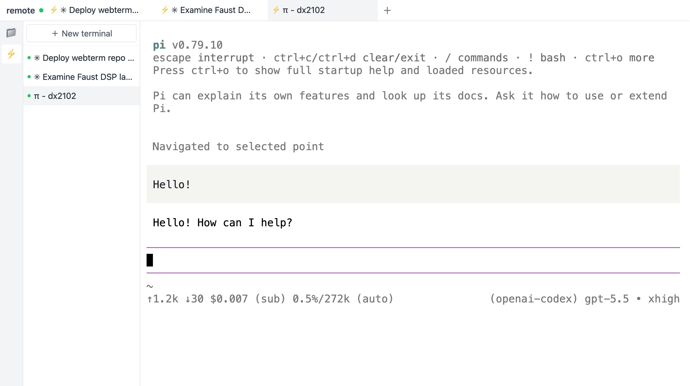

# livetty

This is a simple web app for driving a remote machine: edit files, run terminals, all in the browser.

The terminals are persistent: they keep running even when the browser tab is closed, until you explicitly close them.

Feature-wise it's similar to JupyterLab, but the backend is written in Rust: smaller memory footprint, snappier UI, fewer glitches.

Pair it with a [cloudflared](https://developers.cloudflare.com/cloudflare-one/connections/connect-networks/) tunnel to reach it over the public internet, behind a password.

## Installation

Try everything in the browser:

1. Open one of these free ephemeral Linux terminals (either works, both spin up a temporary Linux VM you can type commands into):
   - **[Killercoda](https://killercoda.com/playgrounds/scenario/ubuntu)**: log in with a GitHub or Google account, click **Start**
   - **[GitHub Codespaces](https://github.com/codespaces/templates)**: log in with a GitHub account, pick the **Blank** template

2. Paste this into the terminal:

    ```bash
    curl -LO https://github.com/dx2102/livetty/releases/latest/download/livetty-linux-x86_64
    curl -LO https://github.com/cloudflare/cloudflared/releases/latest/download/cloudflared-linux-amd64
    chmod +x livetty-linux-x86_64 cloudflared-linux-amd64
    ./livetty-linux-x86_64 serve config.json > livetty.log 2>&1 &
    ./cloudflared-linux-amd64 tunnel --url http://localhost:8737 > cloudflared.log 2>&1 &
    ```

    This downloads the livetty binary and cloudflared, then starts both in the background. Their outputs go to `livetty.log` and `cloudflared.log`.

3. Grab the password:

    ```bash
    cat livetty.log
    ```

    Look for the `initial password: ...` line.

4. Grab the public URL (may take a couple of seconds to appear, `cat` again if you don't see it):

    ```bash
    cat cloudflared.log | grep cloudflare
    ```

    Look for a `https://<random>.trycloudflare.com` line.

5. Open that URL in a new browser tab and log in with the password.

Prebuilt binaries: `linux-x86_64`, `linux-aarch64`, `macos-aarch64` (Apple Silicon).

## Features

- Token / password login, hardened for public exposure (HttpOnly + Secure + SameSite=Strict cookie, constant-time compare, failure rate-limit, WS Origin check to defeat cross-site hijacking)
- Terminals persist across disconnects and self-heal (server-authoritative state, snapshot replay, no visual garbage)
- Mouse scrolling stays in the browser, so it's instant (unlike a ttyd + tmux setup, where every wheel event round-trips through the server)
- ANSI control sequences never get split mid-stream, so no visual garbage
- All terminals share one WebSocket connection: opening a new terminal is instant, no per-session TCP handshake latency
- tmux/zellij-style local CLI: drive terminals from your shell (spawn new ones, send keystrokes, capture snapshots, list, kill)

## Configuration (`config.json`)

| Field | Description |
|---|---|
| `password` | Login password (auto-generated or set by hand). Startup refuses an empty value. |
| `port` / `bind` | Listen port / address (default 8737 / 127.0.0.1) |
| `allowed_origins` | Extra allowed WS Origins (e.g. the vite dev-server port) |

`config.json` and `sessions.json` contain the password and session tokens; both are `.gitignore`d and never checked in.

## Build from source

**Backend**

```bash
cd server
cargo build --release
./target/release/livetty serve config.json   # auto-generates config.json (random password, mode 0600) on first run
```

The initial password is logged and written to `config.json` (default bind: `127.0.0.1:8737`).

**Frontend**

```bash
cd web
bun install
bun run build        # output goes to web/dist, served by the backend
# dev: bun run dev
```

**Named tunnel (custom domain)**: point a cloudflared named tunnel at `your.domain -> localhost:8737`. The server only binds `127.0.0.1`, so the raw port is never exposed.

